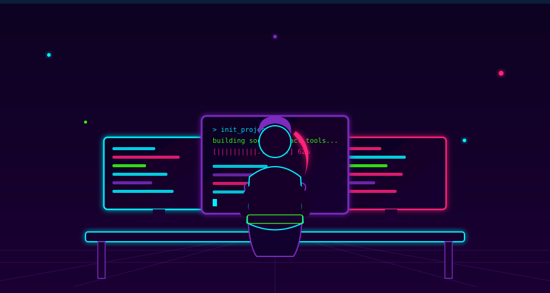

<div align="center">


<br>



<sub>🖥️ just another night shipping code across three monitors</sub>

<br><br>


<br><br>


<br><br>


</div>

## 👩‍💻 &nbsp;`~/about-me`

```yaml
sharmila@dev:~$ cat profile.yaml
name: "Sharmila M"
role: "Frappe Framework Developer @ APF"
education: "BCA Graduate"
mission: "Building meaningful technology for the social sector"
currently_seeking: "Full-time Software Developer role — Social Impact Tech"
status: [Learning, Building, Shipping, Collaborating]  # infinite loop
```

I turn ideas into clean, functional applications — with a pull toward projects that leave the world a little better than I found it. Looking for a **full-time role** where solid engineering meets real social impact. 🚀

<div align="center">

</div>

## ⚡ &nbsp;`~/tech-stack`

<div align="center">


<br><br>


</div>

<div align="center">

</div>

## 🧬 &nbsp;`~/skill-radar`

```
Frappe / ERPNext   ██████████████████░░  90%
Python             ████████████████░░░░  80%
JavaScript         ███████████████░░░░░  75%
HTML / CSS         █████████████████░░░  85%
Git / GitHub       ████████████████░░░░  80%
REST API Design    ██████████████░░░░░░  70%
```

<div align="center">

</div>

## 💼 &nbsp;`~/currently`

<table align="center">
<tr>
<td width="50%" valign="top">

```diff
+ Building & maintaining apps
+ on the Frappe Framework

+ Exploring full-stack dev
+ & open-source contribution
```

</td>
<td width="50%" valign="top">

```diff
+ Seeking full-time roles in
+ social sector / impact tech

+ Leveling up in Python,
+ JavaScript & modern web
```

</td>
</tr>
</table>

<div align="center">

</div>

## 🚀 &nbsp;`~/featured-work`

<table align="center" width="90%">
<tr>
<td width="33%" valign="top" align="center">

**🏥 Metta**
<br>
<sub>Frappe-based stock inventory module for hospital / NGO supply chains — multi-warehouse logic, Purchase Receipt → QC → Bill flow</sub>

</td>
<td width="33%" valign="top" align="center">

**📚 T4GC Session Manager**
<br>
<sub>Google Apps Script automation orchestrating Sheets, Calendar, Meet, Gmail & Forms for a community mentoring program</sub>

</td>
<td width="33%" valign="top" align="center">

**🤰 SVMM MIS Dashboard**
<br>
<sub>Live maternal-health analytics dashboard on Frappe Cloud — 48 metric cards across registration, visits & delivery tracking</sub>

</td>
</tr>
</table>

<div align="center">

</div>

## 📊 &nbsp;`~/github-stats`

<div align="center">


<br>


<br>


</div>

<div align="center">

</div>

## 🏆 &nbsp;`~/trophies`

<div align="center">


</div>

<div align="center">

</div>

## 🐍 &nbsp;`~/contribution-snake`

<div align="center">


</div>

<div align="center">

</div>

## 🌐 &nbsp;`~/connect`

<div align="center">

<a href="mailto:sharmilabio28@gmail.com">

</a>
<a href="https://www.linkedin.com/in/sharmila-m-5b02002a5/">

</a>

</div>

<br>

<div align="center">


<br>


</div>
